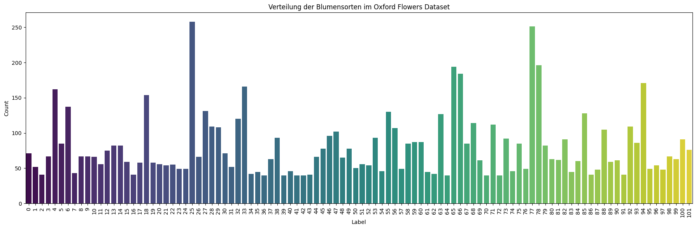
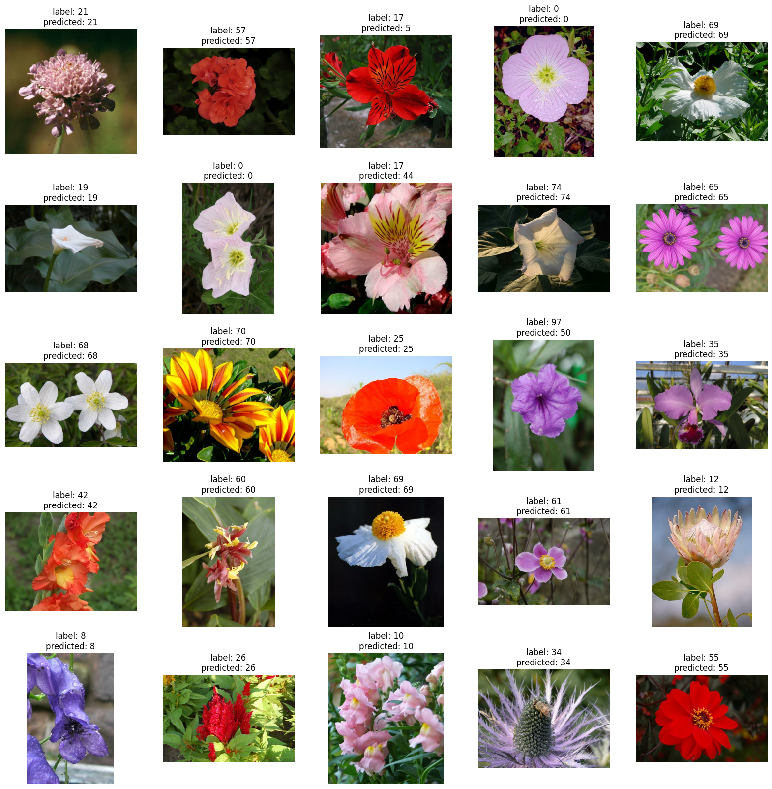

# flower-classifier

## Project Description
Dieses Projekt klassifiziert verschiedene Blumensorten.

### Name & URL
| Name          | URL |
|---------------|-----|
| Huggingface   | [Huggingface Space](https://huggingface.co/spaces/lautenad/flower-classifier) |
| Model Page    | [Huggingface Model Page](https://huggingface.co/spaces/lautenad/flower-classifier) |
| Code          |  https://drive.switch.ch/index.php/s/KR61bLUdbGsMK9q |

## Labels
Die verschiedenen Sorten sind:  
`["pink primrose", "hard-leaved pocket orchid", "canterbury bells", "sweet pea", 
    "english marigold", "tiger lily", "moon orchid", "bird of paradise", "monkshood",
    "globe thistle", "snapdragon", "colt's foot", "king protea", "spear thistle", 
    "yellow iris", "globe-flower", "purple coneflower", "peruvian lily", "balloon flower",
    "giant white arum lily", "fire lily", "pincushion flower", "fritillary", 
    "red ginger", "grape hyacinth", "corn poppy", "prince of wales feathers", 
    "stemless gentian", "artichoke", "sweet william", "carnation", "garden phlox",
    "love in the mist", "mexican aster", "alpine sea holly", "ruby-lipped cattleya",
    "cape flower", "great masterwort", "siam tulip", "lenten rose", "barbeton daisy",
    "daffodil", "sword lily", "poinsettia", "bolero deep blue", "wallflower", 
    "marigold", "buttercup", "oxeye daisy", "common dandelion", "petunia", "wild pansy",
    "primula", "sunflower", "pelargonium", "bishop of llandaff", "gaura", "geranium",
    "orange dahlia", "pink-yellow dahlia?", "cautleya spicata", "japanese anemone",
    "black-eyed susan", "silverbush", "californian poppy", "osteospermum", "spring crocus",
    "bearded iris", "windflower", "tree poppy", "gazania", "azalea", "water lily", 
    "rose", "thorn apple", "morning glory", "passion flower", "lotus", "toad lily", 
    "anthurium", "frangipani", "clematis", "hibiscus", "columbine", "desert-rose", 
    "tree mallow", "magnolia", "cyclamen", "watercress", "canna lily", "hippeastrum", 
    "bee balm", "ball moss", "foxglove", "bougainvillea", "camellia", "mallow", 
    "mexican petunia", "bromelia", "blanket flower", "trumpet creeper", "blackberry lily", 
    "common tulip", "wild rose"]`

## Datenquellen und Features
| Data Source | Description |
|-------------|-------------|
| [Oxford-Flower](https://www.robots.ox.ac.uk/~vgg/data/flowers/102/) | Original dataset from Oxford containing 102 varieties of flowers. |

## Modell Training

### Data Splitting Methode (Train/Validation/Test)

Das Modell wurde mit dem **Oxford Flowers 102** dataset trainiert, welches 8189 Bilder von 102 verschiedenen Blumensorten beinhaltet.
Das originale Datenset war bereits gesplittet. Die gesplitteten Daten wurden deshalb zusammengeführt um die Daten 80/10/10 zu splitten:

| Split      | Number of Images |
|------------|------------------:|
| Train      | 6551              |
| Validation | 819               |
| Test       | 819               |

Das Modell wurde mithilfe eines vortrainierten Vision Transformer (ViT) feinjustiert **Vision Transformer (ViT)**  
[`google/vit-base-patch16-224`](https://huggingface.co/google/vit-base-patch16-224).

---

### Trainingsverlauf

| Epoch | Training Loss | Validation Loss | Accuracy   |
|-------|---------------|-----------------|------------|
| 1     | 0.159700      | 0.129817        | 98.53 %    |
| 2     | 0.054900      | 0.067218        | 99.02 %    |
| 3     | 0.032400      | 0.056815        | 99.02 %    |
| 4     | 0.024700      | 0.051192        | 99.02 %    |
| 5     | 0.017500      | 0.050244        | 99.02 %    |

---

## Resultate

| Modell / Methode                                                       | Accuracy | Precision | Recall |
|------------------------------------------------------------------------|----------|-----------|--------|
| Transfer Learning mit `google/vit-base-patch16-224` | 99.02 %  | —         | —      |
| Zero-Shot Image Classification mit `openai/clip-vit-large-patch14`      | 74.71 %  | 71.36 %   | 74.71 % |

## References
   

